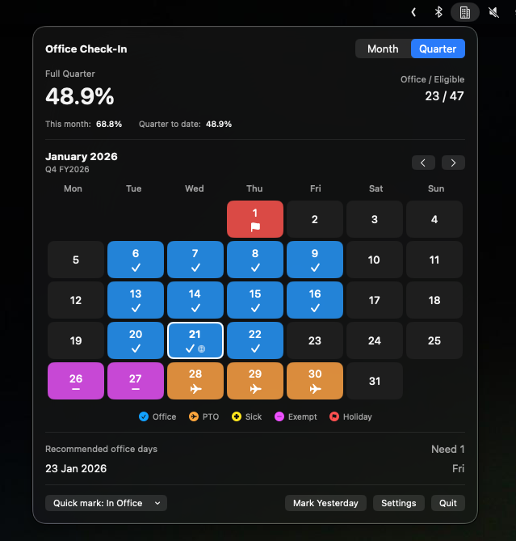

# Office Check‑In

A macOS menubar app for tracking office attendance. Shows your flex percentage for the month/quarter and suggests days to hit your target.

## Install

### Homebrew

```bash
# If you previously used quisharoo/tap, remove it to avoid cask-name ambiguity
brew untap quisharoo/tap 2>/dev/null || true

brew tap quisharoo/office-check-in https://github.com/Quisharoo/office-check-In

# Non-admin (recommended for work devices): install to ~/Applications (no sudo prompt)
mkdir -p "$HOME/Applications"

# Fully-qualify so this is re-runnable and doesn't depend on which taps exist
brew install --cask --appdir="$HOME/Applications" quisharoo/office-check-in/office-check-in || \
  brew upgrade --cask --appdir="$HOME/Applications" quisharoo/office-check-in/office-check-in

xattr -cr "$HOME/Applications/OfficeCheckIn.app"
killall OfficeCheckIn 2>/dev/null || true
open "$HOME/Applications/OfficeCheckIn.app"
```

**Upgrade:**

```bash
brew upgrade --cask --appdir="$HOME/Applications" quisharoo/office-check-in/office-check-in
xattr -cr "$HOME/Applications/OfficeCheckIn.app"
killall OfficeCheckIn 2>/dev/null || true
open "$HOME/Applications/OfficeCheckIn.app"
```

> Note: `xattr` is needed because the app is not notarized.
>
> If you do have admin rights and want a system-wide install, use `--appdir=/Applications`
> and adjust the `xattr`/`open` paths accordingly (Homebrew may prompt for a password).

### Manual

Download from [Releases](https://github.com/Quisharoo/office-check-In/releases/latest), unzip, move to `/Applications`, then run the `xattr` command above.

## Development

### Build from source

```bash
git clone https://github.com/Quisharoo/office-check-In.git
cd office-check-In
swift build -c release --package-path mac/OfficeCheckInApp
```

### Run locally (development)

```bash
# Build and package
./Scripts/package_app.sh

# Remove quarantine and run
xattr -cr dist/OfficeCheckIn.app
open dist/OfficeCheckIn.app
```

Or install to Applications:

```bash
./Scripts/package_app.sh
cp -r dist/OfficeCheckIn.app /Applications/
xattr -cr /Applications/OfficeCheckIn.app
open /Applications/OfficeCheckIn.app
```

## Troubleshooting

**App won't open / "move to bin" error:**
```bash
xattr -cr /Applications/OfficeCheckIn.app
open /Applications/OfficeCheckIn.app
```

**App disappears from menu bar:**
```bash
killall cfprefsd; open /Applications/OfficeCheckIn.app
```

---



